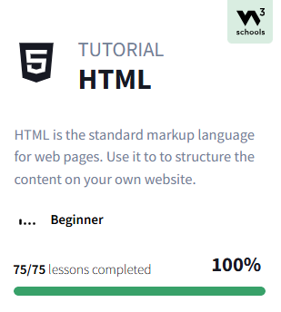

# Привет, я Эмилия - Frontend Developer 💫

---

##  Навыки

- #### Hard skills: 
  + *JavaScript, HTML, CSS, C/C++*
  + React, Bootstrap, Postman
  + Node.js, PostgreSQL, Sequelize
  + GitLab/GitHub, CI/CD
  + Linux, bash/zsh, npm, Docker, QT

- #### Soft skills: 
    + Ответственность и мотивация на результат
    + Дисциплинированность и умение соблюдать дедлайны
    + Клиентоориентированность
    + Деловая коммуникация
    + Стремление к знаниям и саморазвитию

## 📚 Обучение
###  Студент [21 School](https://21-school.ru) (образовательный проект от Cбера)
 

#### Успешно завершенный курс по HTML на W3School  

###  🎓 Учебные проекты
| Name                                                                            | Description                                                                                                                                                                        | Tools                                                                           |
|---------------------------------------------------------------------------------|------------------------------------------------------------------------------------------------------------------------------------------------------------------------------------|---------------------------------------------------------------------------------|
| [Frontend-bootcamp](https://github.com/shmoopella/FrontendBootcamp)                                                           | Проекты, направленные на изучение основ web-разработки                                                                                                                             | JavaScript, HTML, CSS, NodeJS, Express.js, Sequelize, Bootstrap, React, Postman |
| [Linux-проекты](https://github.com/shmoopella/Linux)                            | Освоения системного администрирования, работы с командной строкой, а также базовых и продвинутых аспектов работы с Linux                                                           | Bash, Docker, VirtualBox, Prometheus, Grafana                                   |
| [SQL-проекты](https://github.com/shmoopella/SQL)                                | Cоздание баз данных, анализ данных и разработка персонализированных предложений. Каждый проект нацелен на укрепление навыков работы с SQL-запросами, представлениями и процедурами | PostgreSQL                                                                      |
| [Проекты на языке Си](https://github.com/shmoopella/C-CPP/tree/main/C_projects) | Проекты на Си, знакомство с императивной парадигмой программирования                                                                                                               | С                                                                               |
| [Проекты на С++](https://github.com/shmoopella/C-CPP/tree/main/CPP_projects)    | Проекты на С++, знакомство с ООП, MVC                                                                                                                                              | C++, Qt                                                                         |
| [Algorithms](https://github.com/shmoopella/Algorithms)                          | Изучение алгоритмов: генерация лабиринта и графы                                                                                                                                   | C++                                                                             |

